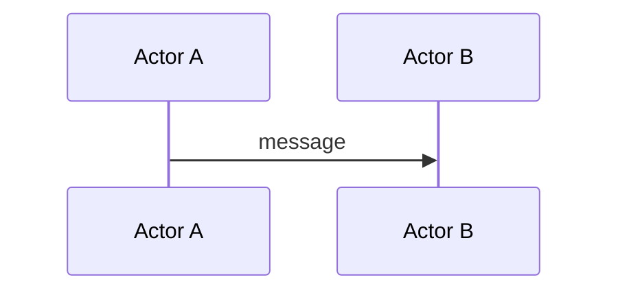

# Future Upgrades

## Visual Diagram Upgrades

### Status: Infrastructure Tested & Ready

All three visual upgrade approaches have been tested and are working in the book. Infrastructure is in place (`mermaid-init.js`, CSS bit-layout classes in `custom.css`, `book.toml` configured). Test diagrams were removed from modules — rollout will happen on a dedicated branch.

---

### Flowcharts & State Diagrams → Mermaid.js ✅ TESTED

**Setup:** `theme/mermaid-init.js` loads Mermaid from CDN (`jsdelivr.net/npm/mermaid@11`). No Rust/cargo dependency needed. Configured in `book.toml` via `additional-js`.

**Tested with:**
- Flash loan callback flow (part2/5-flash-loans.md) → `sequenceDiagram` — arrows between actors, alt/else branching for success/revert
- Governance proposal lifecycle (part3/8-governance.md) → `stateDiagram-v2` — states with transitions, added Defeated branch that ASCII omits

**Best candidates for rollout:**
- Flash loan callback flow → `sequenceDiagram`
- Governance proposal lifecycle → `stateDiagram-v2`
- Aave V3 liquidation flow (part2/4-lending.md) → `flowchart TD`
- MEV/PBS supply chain (part3/5-mev.md) → `flowchart TD`
- Collateral swap 6-step flow (part2/5-flash-loans.md) → `flowchart TD`
- CALL vs DELEGATECALL context (part4/5-external-calls.md) → `flowchart LR`

**Usage pattern:**
````markdown

````

**What to keep as ASCII:** Math curves with inline annotations (e.g., kinked interest rate curve) — the annotations ARE the teaching value.

---

### Bit Layout Diagrams → CSS-styled HTML blocks ✅ TESTED

**Setup:** CSS classes in `theme/custom.css` (`.bit-layout`, `.bit-fields`, `.bit-field`, `.bit-ruler`, `.bf-*` color classes).

**Tested with:**
- Aave V3 ReserveConfigurationMap (part4/3-storage.md) — 4-field horizontal layout with color-coded fields and bit position rulers
- BalanceDelta packing (part1/1-solidity-modern.md) — 2-field int128|int128 split
- EVM memory layout (part4/2-memory-calldata.md) — vertical stacked regions with offset labels (uses inline styles, not the `.bit-field` classes)

**Available colors:** `bf-blue`, `bf-amber`, `bf-orange`, `bf-red`, `bf-green`, `bf-purple`, `bf-cyan`, `bf-gray` — all with light theme variants.

**Usage pattern (horizontal bit fields):**
```html
<div class="bit-layout">
  <div class="bit-layout-title">Title</div>
  <div class="bit-ruler">
    <span style="flex:16">63</span>
    <span style="flex:16">0</span>
  </div>
  <div class="bit-fields">
    <div class="bit-field bf-blue" style="flex:16">
      <span class="bit-field-name">Field Name</span>
      <span class="bit-field-width">16 bits</span>
    </div>
  </div>
</div>
```

**Best candidates for rollout:**
- Aave V3 ReserveConfigurationMap (part4/3-storage.md)
- BalanceDelta packing (part1/1-solidity-modern.md)
- Address + uint96 packing (part4/3-storage.md)
- EVM memory layout (part4/2-memory-calldata.md) — vertical variant

---

### Tables (CSS only — easy)
Tables are already rendered as HTML by mdBook. Current styling includes alternating rows and hover effects. Could be polished further (accent-colored headers, rounded corners) — pure CSS work in `theme/custom.css`.

### Architecture Diagrams → SVG (high effort)
Tools: Excalidraw, Figma, or draw.io. Export as SVG, embed in markdown.
Maximum visual control but enormous effort — hundreds of ASCII diagrams across 25+ modules.
Reserve for a few high-impact diagrams only (e.g., Uniswap V4 architecture, Aave V3 contract map).

### Keep as ASCII
ASCII diagrams inside code blocks are the standard in protocol docs, EIPs, and audit reports.
Reading ASCII diagrams is itself a useful skill. Most stack traces, memory dumps, and slot layouts are fine as-is.
Math curves with inline annotations should stay ASCII — the annotations are the teaching value.

---

### Rollout Plan
1. Create dedicated branch (`visual-upgrades` or similar)
2. Convert Mermaid candidates module by module (replace ASCII, don't duplicate)
3. Convert CSS bit-layout candidates
4. Review each module in browser before merging
5. Polish table CSS if time permits
6. Selective SVG for 3-5 hero diagrams (lowest priority)
