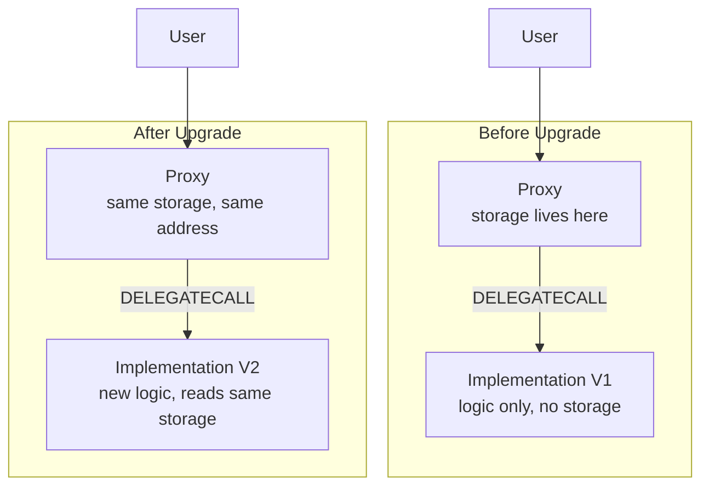

# Part 1 — Module 6: Proxy Patterns & Upgradeability

> **Difficulty:** Advanced
>
> **Estimated reading time:** ~25 minutes | **Exercises:** ~5-6 hours

## 📚 Table of Contents

**Why Proxies Matter for DeFi**

**Proxy Fundamentals**
- [How Proxies Work](#how-proxies-work)
- [Transparent Proxy Pattern](#transparent-proxy)
- [UUPS Pattern (ERC-1822)](#uups-pattern)
- [Beacon Proxy](#beacon-proxy)
- [Diamond Pattern (EIP-2535) — Awareness](#diamond-pattern)

**Storage Layout and Initializers**
- [Storage Layout Compatibility](#storage-layout)
- [Initializers vs Constructors](#initializers)
- [Build Exercise: Proxy Patterns](#day14-15-exercise)

---

<a id="why-proxies-matter"></a>
## 💡 Why Proxies Matter for DeFi

**Why this matters:** Every major DeFi protocol uses proxy patterns—[Aave V3](https://github.com/aave/aave-v3-core), Compound V3, Uniswap's periphery contracts, MakerDAO's governance modules. The [Compound COMP token distribution bug](https://www.comp.xyz/t/bug-disclosure/2451) ($80M+ at risk) would have been fixable with a proxy pattern. Understanding proxies is non-negotiable for reading production code and deploying your own protocols.

In Part 2, you'll encounter: Aave V3 (transparent proxy + libraries), Compound V3 (custom proxy), MakerDAO (complex delegation patterns).

> 🔍 **Deep dive:** Read [EIP-1967](https://eips.ethereum.org/EIPS/eip-1967) to understand how proxy storage slots are chosen (specific slots to avoid collisions).

---

## 💡 Proxy Fundamentals

<a id="how-proxies-work"></a>
### 💡 Concept: How Proxies Work

**The core mechanic:**

A proxy contract delegates all calls to a separate implementation contract using `DELEGATECALL`. The proxy holds the storage; the implementation holds the logic. Upgrading means pointing the proxy to a new implementation—storage persists, logic changes.



**⚠️ The critical constraint:** **Storage layout must be compatible across versions.** If V1 stores `uint256 totalSupply` at slot 0 and V2 stores `address owner` at slot 0, the upgrade corrupts all data. This is the #1 source of proxy-related exploits.

💻 **Quick Try:**

Paste this into [Remix](https://remix.ethereum.org/) to feel how `DELEGATECALL` works:

```solidity
// SPDX-License-Identifier: MIT
pragma solidity ^0.8.20;

contract Implementation {
    uint256 public value;  // slot 0
    function setValue(uint256 _val) external { value = _val; }
}

contract Proxy {
    uint256 public value;  // slot 0 — SAME layout as Implementation
    address public impl;

    constructor(address _impl) { impl = _impl; }

    fallback() external payable {
        (bool ok,) = impl.delegatecall(msg.data);
        require(ok);
    }
}
```

Deploy `Implementation`, then deploy `Proxy` with the implementation address. Call `setValue(42)` on the Proxy — then read `value` from the Proxy. It's 42! But read `value` from Implementation — it's 0. **The proxy's storage changed, not the implementation's.** That's `DELEGATECALL`.

> ⚠️ Notice that `impl` at slot 1 could be overwritten by the implementation contract — this is exactly why EIP-1967 random storage slots exist (covered below).

#### ⚠️ Common Mistakes

```solidity
// ❌ WRONG: Using call instead of delegatecall
fallback() external payable {
    (bool ok,) = impl.call(msg.data);  // Runs in implementation's context!
    // Storage writes go to the IMPLEMENTATION, not the proxy
}

// ✅ CORRECT: delegatecall executes in the caller's (proxy's) storage context
fallback() external payable {
    (bool ok,) = impl.delegatecall(msg.data);
    require(ok);
}

// ❌ WRONG: Proxy state stored in normal slots — collides with implementation
contract BadProxy {
    address public implementation;  // slot 0 — collides with implementation's slot 0!
    fallback() external payable {
        (bool ok,) = implementation.delegatecall(msg.data);
        require(ok);
    }
}

// ✅ CORRECT: Use EIP-1967 slots for proxy-internal state
// Derived from hashing a known string — collision-resistant
bytes32 constant _IMPL_SLOT =
    bytes32(uint256(keccak256("eip1967.proxy.implementation")) - 1);

// ❌ WRONG: Expecting the implementation's state to change
Implementation impl = new Implementation();
Proxy proxy = new Proxy(address(impl));
proxy.setValue(42);
impl.value();  // Returns 0, NOT 42! The proxy's storage changed, not impl's
```

---

<a id="transparent-proxy"></a>
### 💡 Concept: Transparent Proxy Pattern

> OpenZeppelin's pattern, defined in [TransparentUpgradeableProxy.sol](https://github.com/OpenZeppelin/openzeppelin-contracts/blob/master/contracts/proxy/transparent/TransparentUpgradeableProxy.sol)

**How it works:**

Separates admin calls from user calls:
- If `msg.sender == admin`: the proxy handles the call directly (upgrade functions)
- If `msg.sender != admin`: the proxy delegates to the implementation

This prevents:
1. The admin from accidentally calling implementation functions
2. Function selector clashes between proxy admin functions and implementation functions

**📊 Trade-offs:**

| Aspect | Pro/Con | Details |
|--------|---------|---------|
| **Mental model** | ✅ Pro | Simple to understand |
| **Admin safety** | ✅ Pro | Admin can't accidentally interact with implementation |
| **Gas cost** | ❌ Con | Every call checks `msg.sender == admin` (~100 gas overhead) |
| **Admin limitation** | ❌ Con | Admin address can **never** interact with implementation |
| **Deployment** | ❌ Con | Extra contract (ProxyAdmin) |

**Evolution:** OpenZeppelin V5 moved the admin logic to a separate `ProxyAdmin` contract to reduce gas for regular users.

> ⚡ **Common pitfall:** Trying to call implementation functions as admin. You'll get `0x` (empty) return data because the proxy intercepts it. Use a different address to interact with the implementation.

#### 🔍 Deep Dive: EIP-1967 Storage Slots

**The problem:** Where does the proxy store the implementation address? If it uses slot 0, it collides with the implementation's first variable. If it uses any normal slot, there's a risk of collision with any contract.

**The solution:** EIP-1967 defines specific storage slots derived from hashing a known string, making collision practically impossible:

```
┌──────────────────────────────────────────────────────────────────┐
│                    EIP-1967 Storage Slots                        │
│                                                                  │
│  Implementation slot:                                            │
│  bytes32(uint256(keccak256("eip1967.proxy.implementation")) - 1) │
│  = 0x360894...bef9  (slot for implementation address)            │
│                                                                  │
│  Admin slot:                                                     │
│  bytes32(uint256(keccak256("eip1967.proxy.admin")) - 1)          │
│  = 0xb53127...676a  (slot for admin address)                     │
│                                                                  │
│  Beacon slot:                                                    │
│  bytes32(uint256(keccak256("eip1967.proxy.beacon")) - 1)         │
│  = 0xa3f0ad...f096  (slot for beacon address)                    │
└──────────────────────────────────────────────────────────────────┘
```

**Why `- 1`?** The subtraction prevents the slot from having a known preimage under `keccak256`. This is a security measure — without it, a malicious implementation contract could theoretically compute a storage variable that lands on the same slot.

**Reading these slots in Foundry:**

```solidity
// Read the implementation address from any EIP-1967 proxy
bytes32 implSlot = bytes32(uint256(keccak256("eip1967.proxy.implementation")) - 1);
address impl = address(uint160(uint256(vm.load(proxyAddress, implSlot))));
```

**Where you'll use this:** Reading proxy implementations on Etherscan, verifying upgrades in fork tests, building monitoring tools that track implementation changes.

---

<a id="uups-pattern"></a>
### 💡 Concept: UUPS Pattern (ERC-1822)

**Why this matters:** UUPS is now the **recommended** pattern for new deployments. Cheaper gas, more flexible upgrade logic. Used by: Uniswap V4 periphery, modern protocols.

> Defined in [ERC-1822](https://eips.ethereum.org/EIPS/eip-1822) (Universal Upgradeable Proxy Standard)

**How it works:**

Universal Upgradeable Proxy Standard puts the upgrade logic **in the implementation**, not the proxy:

```solidity
// Implementation contract
contract VaultV1 is UUPSUpgradeable, OwnableUpgradeable {
    function _authorizeUpgrade(address newImplementation) internal override onlyOwner {}

    // ... vault logic
}
```

The proxy is minimal (just `DELEGATECALL` forwarding). The implementation includes `upgradeTo()` inherited from `UUPSUpgradeable`.

**📊 Trade-offs vs Transparent:**

| Feature | UUPS ✅ | Transparent |
|---------|---------|-------------|
| **Gas cost** | Cheaper (no admin check) | Higher (~100 gas/call) |
| **Flexibility** | Custom upgrade logic per version | Fixed upgrade logic |
| **Deployment** | Simpler (no ProxyAdmin) | Requires ProxyAdmin |
| **Risk** | Can brick if upgrade logic is missing | Safer for upgrades |

**⚠️ UUPS Risks:**
- If you deploy an implementation **without the upgrade function** (or with a bug in it), the proxy becomes non-upgradeable forever
- Must remember to include UUPS logic in every implementation version

> ⚡ **Common pitfall:** Forgetting to call `_disableInitializers()` in the implementation constructor. This allows someone to initialize the implementation contract directly (not through the proxy), potentially causing issues.

**🏗️ Real usage:**

[OpenZeppelin UUPS implementation](https://github.com/OpenZeppelin/openzeppelin-contracts-upgradeable/blob/master/contracts/proxy/utils/UUPSUpgradeable.sol) — production reference.

> 🔍 **Deep dive:** [OpenZeppelin - UUPS Proxy Guide](https://docs.openzeppelin.com/contracts/5.x/api/proxy#UUPSUpgradeable) provides official documentation. [Cyfrin Updraft - UUPS Proxies Tutorial](https://updraft.cyfrin.io/courses/advanced-foundry/upgradeable-smart-contracts/introduction-to-uups-proxies) offers hands-on Foundry examples. [OpenZeppelin - Proxy Upgrade Pattern](https://docs.openzeppelin.com/upgrades-plugins/proxies) covers best practices and common pitfalls.

#### 🎓 Intermediate Example: Minimal UUPS Proxy

Before using OpenZeppelin's abstractions, understand what's happening underneath. Here's a stripped-down UUPS pattern:

```solidity
// Minimal UUPS Proxy — for understanding, not production!
contract MinimalUUPSProxy {
    // EIP-1967 implementation slot
    bytes32 private constant _IMPL_SLOT =
        bytes32(uint256(keccak256("eip1967.proxy.implementation")) - 1);

    constructor(address impl, bytes memory initData) {
        // Store implementation address
        assembly { sstore(_IMPL_SLOT, impl) }

        // Call initialize on the implementation (via delegatecall)
        if (initData.length > 0) {
            (bool ok,) = impl.delegatecall(initData);
            require(ok, "Init failed");
        }
    }

    fallback() external payable {
        assembly {
            // Load implementation from EIP-1967 slot
            let impl := sload(_IMPL_SLOT)

            // Copy calldata to memory
            calldatacopy(0, 0, calldatasize())

            // Delegatecall to implementation
            let result := delegatecall(gas(), impl, 0, calldatasize(), 0, 0)

            // Copy return data
            returndatacopy(0, 0, returndatasize())

            // Return or revert based on result
            switch result
            case 0 { revert(0, returndatasize()) }
            default { return(0, returndatasize()) }
        }
    }
}

// The implementation includes the upgrade function
contract VaultV1 {
    // EIP-1967 slot (same constant)
    bytes32 private constant _IMPL_SLOT =
        bytes32(uint256(keccak256("eip1967.proxy.implementation")) - 1);

    address public owner;
    uint256 public totalDeposits;

    function initialize(address _owner) external {
        require(owner == address(0), "Already initialized");
        owner = _owner;
    }

    // UUPS: upgrade logic lives in the implementation
    function upgradeTo(address newImpl) external {
        require(msg.sender == owner, "Not owner");
        assembly { sstore(_IMPL_SLOT, newImpl) }
    }
}
```

**Key insight:** The proxy is ~20 lines of assembly. All the complexity is in the implementation — that's why forgetting `upgradeTo` in V2 bricks the proxy forever. OpenZeppelin's `UUPSUpgradeable` adds safety checks (implementation validation, rollback tests) that you should always use in production.

#### ⚠️ Common Mistakes

```solidity
// ❌ WRONG: V2 doesn't inherit UUPSUpgradeable — proxy bricked forever!
contract VaultV2 {
    // Forgot to include upgrade capability
    // No way to ever call upgradeTo again — proxy is permanently stuck on V2
}

// ✅ CORRECT: Every version MUST preserve upgrade capability
contract VaultV2 is UUPSUpgradeable, OwnableUpgradeable {
    function _authorizeUpgrade(address) internal override onlyOwner {}
}

// ❌ WRONG: No access control on _authorizeUpgrade
contract VaultV1 is UUPSUpgradeable {
    function _authorizeUpgrade(address) internal override {
        // Anyone can upgrade the proxy to a malicious implementation!
    }
}

// ✅ CORRECT: Restrict who can authorize upgrades
contract VaultV1 is UUPSUpgradeable, OwnableUpgradeable {
    function _authorizeUpgrade(address) internal override onlyOwner {}
}

// ❌ WRONG: Calling upgradeTo on the implementation directly
implementation.upgradeTo(newImpl);  // Changes nothing — impl has no proxy storage

// ✅ CORRECT: Call upgradeTo through the proxy
VaultV1(address(proxy)).upgradeTo(newImpl);  // Proxy's EIP-1967 slot gets updated
```

---

<a id="beacon-proxy"></a>
### 💡 Concept: Beacon Proxy

**Why this matters:** When you have 100+ proxy instances that share the same logic, upgrading them individually is expensive and error-prone. Beacon proxies let you upgrade ALL instances in a single transaction. ✨

> Defined in [BeaconProxy.sol](https://github.com/OpenZeppelin/openzeppelin-contracts/blob/master/contracts/proxy/beacon/BeaconProxy.sol)

**How it works:**

Multiple proxy instances share a single upgrade beacon that points to the implementation. Upgrading the beacon upgrades ALL proxies simultaneously.

```
Proxy A ─→ Beacon ─→ Implementation V1
Proxy B ─→ Beacon ─→ Implementation V1
Proxy C ─→ Beacon ─→ Implementation V1

After beacon update:
Proxy A ─→ Beacon ─→ Implementation V2
Proxy B ─→ Beacon ─→ Implementation V2
Proxy C ─→ Beacon ─→ Implementation V2
```

**🏗️ DeFi use case:**

Beacon proxies are ideal when you have many instances sharing the same logic. For example, a protocol with 100+ token wrappers could deploy each as a beacon proxy — upgrading the beacon's implementation address upgrades all instances atomically in a single `SSTORE`.

> **Note:** [Aave V3's aTokens](https://github.com/aave/aave-v3-core/blob/master/contracts/protocol/tokenization/AToken.sol) use a similar concept but with individual transparent-style proxies (`InitializableImmutableAdminUpgradeabilityProxy`), not a shared beacon. Each aToken is upgraded individually via [`PoolConfigurator.updateAToken()`](https://github.com/aave/aave-v3-core/blob/master/contracts/protocol/pool/PoolConfigurator.sol), which can be batched in a single governance transaction but still requires N separate proxy storage writes.

**📊 Trade-offs:**

| Aspect | Pro/Con |
|--------|---------|
| **Batch upgrades** | ✅ Pro — Upgrade many instances in one tx |
| **Gas efficiency** | ✅ Pro — Single upgrade vs many |
| **Flexibility** | ❌ Con — All instances must use same implementation |

---

<a id="diamond-pattern"></a>
### 💡 Concept: Diamond Pattern (EIP-2535) — Awareness

**What it is:**

The Diamond pattern allows a single proxy to delegate to **multiple** implementation contracts (called "facets"). Each function selector routes to its specific facet.

**🏗️ Used by:**
- LI.FI protocol (cross-chain aggregator)
- Some larger protocols with complex modular architectures

**📊 Trade-off:**

| Aspect | Pro/Con | Details |
|--------|---------|---------|
| **Modularity** | ✅ Pro | Split 100+ functions across domains |
| **Complexity** | ❌ Con | Significantly more complex |
| **Security risk** | ⚠️ Warning | [LI.FI exploit (July 2024, $10M)](https://rekt.news/lifi-rekt/) caused by facet validation bug |

**Recommendation:** For most DeFi protocols, UUPS or Transparent Proxy is sufficient. Diamond is worth knowing about but rarely needed. Complexity is a security risk.

#### 🔗 DeFi Pattern Connection

**Which proxy pattern do real protocols use?**

| Protocol | Pattern | Why |
|----------|---------|-----|
| **Aave V3** | Transparent (admin-immutable) | Transparent for core contracts; aTokens use individual proxies upgraded via `PoolConfigurator` (batchable in one governance tx) |
| **Compound V3 (Comet)** | Custom proxy | Immutable implementation with configurable parameters — minimal proxy overhead |
| **Uniswap V4** | UUPS (periphery) | Core PoolManager is immutable; only periphery uses UUPS for flexibility |
| **MakerDAO** | Custom delegation | `delegatecall`-based module system predating EIP standards |
| **OpenSea (Seaport)** | Immutable | No proxy at all — designed to be replaced, not upgraded |
| **Morpho Blue** | Immutable | Intentionally non-upgradeable for trust minimization |

**Industry direction:** Many protocols are choosing **immutable cores** with upgradeable periphery. The core logic (AMM math, lending logic) is deployed once and never changed — trust minimization. Only the parts that need flexibility (fee parameters, routing, UI adapters) use proxies.

**Why this matters for DeFi:**

1. **Protocol trust** — Users must trust that upgradeable contracts won't rug them. Immutable contracts with governance-controlled parameters are the emerging pattern
2. **Composability** — Other protocols integrating with yours need to know: will the interface change? Proxies make this uncertain
3. **Audit scope** — Every upgradeable contract doubles the audit surface (current + all possible future implementations)

#### 💼 Job Market Context

**What DeFi teams expect you to know:**

1. **"When would you use UUPS vs Transparent vs no proxy at all?"**
   - Good answer: "UUPS for new deployments, Transparent for legacy, no proxy for trust-minimized core logic"
   - Great answer: "It depends on the trust model. For core protocol logic that handles user funds, I'd argue for immutable contracts — users shouldn't trust that an upgrade won't change the rules. For periphery (routers, adapters, fee modules), UUPS gives flexibility with lower gas overhead than Transparent. Beacon makes sense when you have many instances of the same contract (e.g., token vaults, lending pools) and want atomic upgrades. Note that Aave V3's aTokens actually use individual transparent-style proxies upgraded via governance, not a shared beacon. I'd avoid Diamond unless the protocol truly needs 100+ functions split across domains"

2. **"What's the biggest risk with upgradeable contracts?"**
   - Good answer: "Storage collisions and uninitialized proxies"
   - Great answer: "Three categories: (1) Storage collisions — silent data corruption when layout changes, caught with `forge inspect` in CI. (2) Initialization attacks — front-running `initialize()` calls to take ownership. (3) Trust risk — governance or multisig can change the implementation, which means users are trusting the upgrade authority, not just the code. The best mitigation is timelocked upgrades with on-chain governance"

**Interview Red Flags:**
- 🚩 Not knowing the difference between UUPS and Transparent proxy
- 🚩 Suggesting Diamond pattern for a simple protocol (over-engineering)
- 🚩 Not mentioning storage layout risks when discussing upgrades
- 🚩 Not considering the trust implications of upgradeability

**Pro tip:** In interviews, discussing the *trade-off between upgradeability and trust minimization* shows protocol design maturity. Saying "I'd make the core immutable and only use proxies for periphery" is a strong signal.

---

## 💡 Storage Layout and Initializers

<a id="storage-layout"></a>
### 💡 Concept: Storage Layout Compatibility

**Why this matters:** The #1 risk with proxy upgrades is **storage collisions**. [Audius governance takeover exploit](https://www.openzeppelin.com/blog/audius-governance-takeover-post-mortem) ($6M+ at risk) was caused by storage layout mismatch. This is silent, catastrophic, and happens at deployment—not caught by tests unless you specifically check.

**How Solidity assigns storage:**

Solidity assigns storage slots sequentially. If V2 adds a variable **before** existing ones, every subsequent slot shifts, corrupting data.

```solidity
// V1
contract VaultV1 {
    uint256 public totalSupply;              // slot 0
    mapping(address => uint256) balances;    // slot 1
}

// ❌ V2 — WRONG: inserts before existing variables
contract VaultV2 {
    address public owner;                    // slot 0 ← COLLISION with totalSupply!
    uint256 public totalSupply;              // slot 1 ← COLLISION with balances!
    mapping(address => uint256) balances;    // slot 2
}

// ✅ V2 — CORRECT: append new variables after existing ones
contract VaultV2 {
    uint256 public totalSupply;              // slot 0 (same)
    mapping(address => uint256) balances;    // slot 1 (same)
    address public owner;                    // slot 2 (new, appended)
}
```

**Storage gaps:**

To allow future inheritance changes, reserve empty slots. Gap size = target total slots - number of state variables in the contract. With a target of 50 total slots:

```solidity
contract VaultV1 is Initializable {
    uint256 public totalSupply;              // slot 0
    mapping(address => uint256) balances;    // slot 1
    uint256[48] private __gap;  // ✅ 50 - 2 state vars = 48 gap slots (total 50 slots)
}

contract VaultV2 is Initializable {
    uint256 public totalSupply;              // slot 0 (same)
    mapping(address => uint256) balances;    // slot 1 (same)
    address public owner;                    // slot 2 (new — added 1 variable)
    uint256[47] private __gap;  // ✅ 48 - 1 new var = 47 gap slots (total still 50 slots)
}
```

> **Gap math rule:** When adding N new state variables, reduce `__gap` size by N. Each variable occupies one slot (even `uint128` — packed structs are the exception, but it's safer to count full slots). Always verify with `forge inspect`.

**`forge inspect` for storage layout:**

```bash
# View storage layout of a contract
forge inspect src/VaultV1.sol:VaultV1 storage-layout

# Compare two versions (catch collisions before upgrade)
forge inspect src/VaultV1.sol:VaultV1 storage-layout > v1-layout.txt
forge inspect src/VaultV2.sol:VaultV2 storage-layout > v2-layout.txt
diff v1-layout.txt v2-layout.txt
```

> ⚡ **Common pitfall:** Changing the inheritance order. If V1 inherits `A, B` and V2 inherits `B, A`, the storage layout changes even if no variables were added. Always maintain inheritance order.

> 🔍 **Deep dive:** [Foundry Storage Check Tool](https://github.com/Rubilmax/foundry-storage-check) automates collision detection in CI/CD. [RareSkills - OpenZeppelin Foundry Upgrades](https://rareskills.io/post/openzeppelin-foundry-upgrades) covers the OZ Foundry upgrades plugin. [Runtime Verification - Foundry Upgradeable Contracts](https://runtimeverification.com/blog/using-foundry-to-explore-upgradeable-contracts-part-1) provides practical verification patterns.

> 📝 **Modern Alternative:** OpenZeppelin V5 introduced ERC-7201 (`@custom:storage-location`) as a successor to `__gap` patterns. It uses namespaced storage at deterministic slots, eliminating the need for manual gap management. Worth exploring for new projects.

---

<a id="initializers"></a>
### 💡 Concept: Initializers vs Constructors

**The problem:**

Constructors don't work with proxies—the constructor runs on the **implementation** contract, not the proxy. The proxy's storage is never initialized. ❌

**The solution:**

Replace constructors with `initialize()` functions that can only be called once:

```solidity
import "@openzeppelin/contracts-upgradeable/proxy/utils/Initializable.sol";
import "@openzeppelin/contracts-upgradeable/access/OwnableUpgradeable.sol";

contract VaultV1 is Initializable, OwnableUpgradeable {
    uint256 public totalSupply;

    /// @custom:oz-upgrades-unsafe-allow constructor
    constructor() {
        _disableInitializers();  // ✅ Prevent implementation from being initialized
    }

    function initialize(address _owner) public initializer {
        __Ownable_init(_owner);
    }
}
```

**⚠️ The uninitialized proxy attack:**

If `initialize()` can be called by anyone (or called again), an attacker can take ownership. Real exploits:
- [Wormhole bridge initialization attack](https://medium.com/immunefi/wormhole-uninitialized-proxy-bugfix-review-90250c41a43a) ($10M+ at risk, caught before exploit)

**Protection mechanisms:**

1. ✅ `initializer` modifier: prevents re-initialization
2. ✅ `reinitializer(n)` modifier: allows controlled version-bumped re-initialization for upgrades that need to set new state
3. ✅ `_disableInitializers()` in constructor: prevents someone from initializing the implementation contract directly

> ⚡ **Common pitfall:** Deploying a proxy and forgetting to call `initialize()` in the same transaction. An attacker can front-run and call it first. Use a factory pattern or atomic deploy+initialize.

#### 🔗 DeFi Pattern Connection

**Where storage and initialization bugs caused real exploits:**

1. **Storage Collision — Audius ($6M+ at risk, 2022)**:
   - Governance proxy upgraded with mismatched storage layout
   - Attacker exploited the corrupted storage to pass governance proposals
   - Root cause: inheritance order changed between versions
   - **Lesson:** Always verify storage layout with `forge inspect` before upgrading

2. **Uninitialized Proxy — Wormhole ($10M+ at risk, 2022)**:
   - Implementation contract was not initialized after deployment
   - Attacker could call `initialize()` on the implementation directly
   - Fixed before exploitation, discovered through bug bounty
   - **Lesson:** Always call `_disableInitializers()` in the constructor

3. **Initializer Re-entrancy — [Parity Wallet ($150M locked, 2017)](https://medium.com/paritytech/a-postmortem-on-the-parity-multi-sig-library-self-destruct-63daca3a4cf7)**:
   - The `initWallet()` function could be called by anyone on the library contract
   - Attacker became owner of the library, then called `selfdestruct`
   - All wallets using the library lost access to their funds forever
   - **Lesson:** The original "why initializers matter" incident

4. **Storage Gap Miscalculation**:
   - Common audit finding: adding a variable but not reducing the `__gap` by the right amount
   - With packed structs, a single `uint128` variable consumes a full slot in the gap
   - **Lesson:** Count slots, not variables. Use `forge inspect` to verify

#### ⚠️ Common Mistakes

```solidity
// ❌ Mistake 1: Changing inheritance order
contract V1 is Initializable, OwnableUpgradeable, PausableUpgradeable { ... }
contract V2 is Initializable, PausableUpgradeable, OwnableUpgradeable { ... }
// Storage layout CHANGED even though same variables exist!

// ❌ Mistake 2: Not protecting the implementation
contract VaultV1 is UUPSUpgradeable {
    // Missing: constructor() { _disableInitializers(); }
    // Anyone can call initialize() on the implementation contract directly
}

// ❌ Mistake 3: Using constructor logic in upgradeable contracts
contract VaultV1 is UUPSUpgradeable {
    address public owner;
    constructor() {
        owner = msg.sender;  // This sets owner on the IMPLEMENTATION, not the proxy!
    }
}

// ❌ Mistake 4: Removing immutable variables between versions
contract V1 { uint256 public immutable fee = 100; }  // NOT in storage
contract V2 { uint256 public fee = 100; }             // IN storage at slot 0 — collision!
```

#### 💼 Job Market Context

**What DeFi teams expect you to know:**

1. **"How do you ensure storage layout compatibility between versions?"**
   - Good answer: "Append-only variables, storage gaps, `forge inspect`"
   - Great answer: "I run `forge inspect` on both versions and diff the layouts before any upgrade. In CI, I use the [foundry-storage-check](https://github.com/Rubilmax/foundry-storage-check) tool to automatically catch layout regressions. I maintain `__gap` arrays sized so total slots stay constant, and I never change inheritance order. For complex upgrades, I write a fork test that deploys the new implementation against the live proxy state and verifies all existing data reads correctly"

2. **"Walk me through a safe upgrade process"**
   - Good answer: "Deploy new implementation, verify storage layout, upgrade proxy"
   - Great answer: "First, I diff storage layouts with `forge inspect`. Then I deploy the new implementation and write a fork test that: (1) forks mainnet with the live proxy, (2) upgrades to the new implementation, (3) verifies all existing state reads correctly, (4) tests new functionality. Only after the fork test passes do I prepare the governance proposal or multisig transaction. For UUPS, I also verify the new implementation has `_authorizeUpgrade` — without it, the proxy becomes permanently non-upgradeable"

3. **"What's the uninitialized proxy attack?"**
   - This is a common interview question. Know the Wormhole and Parity examples, and explain the three protections: `initializer` modifier, `_disableInitializers()`, and atomic deploy+initialize

**Interview Red Flags:**
- 🚩 Not knowing about storage layout compatibility
- 🚩 Forgetting `_disableInitializers()` in implementation constructors
- 🚩 Not mentioning `forge inspect` or automated layout checking
- 🚩 Treating upgradeable and non-upgradeable contracts identically

**Pro tip:** Storage layout bugs are the #1 finding in upgrade audits. Being able to explain `forge inspect storage-layout`, `__gap` patterns, and inheritance ordering shows you've actually worked with upgradeable contracts in production.

---

#### 📖 How to Study Production Proxy Architectures

When you encounter a proxy-based protocol (which is most of DeFi), here's how to navigate the code:

**Step 1: Identify the proxy type**
On Etherscan, look for the "Read as Proxy" tab. This tells you:
- The proxy address (what users interact with)
- The implementation address (where the logic lives)
- The admin address (who can upgrade)

**Step 2: Read the implementation, not the proxy**
The proxy itself is usually minimal (just `fallback` + `DELEGATECALL`). All the interesting logic is in the implementation. On Etherscan, click "Read as Proxy" to see the implementation's ABI.

**Step 3: Check the storage layout**
For Aave V3, look at how they organize storage:
```
Pool.sol inherits:
  ├── PoolStorage (defines all state variables)
  ├── VersionedInitializable (custom initializer)
  └── IPool (interface)
```
The pattern: one base contract holds ALL storage, preventing inheritance conflicts.

**Step 4: Trace the upgrade path**
Look for:
- `upgradeTo()` or `upgradeToAndCall()` — who can call it?
- Is there a timelock? A multisig?
- What governance process is required?
- Aave V3: Governed by [Aave Governance V3](https://governance.aave.com/) with timelock

**Step 5: Verify the initializer chain**
Check that every base contract's initializer is called:
```solidity
function initialize(IPoolAddressesProvider provider) external initializer {
    __Pool_init(provider);       // Calls PoolStorage init
    // All parent initializers must be called
}
```

**Don't get stuck on:** The proxy contract's assembly code. Once you understand the pattern (it delegates everything), focus entirely on the implementation.

---

<a id="day14-15-exercise"></a>
## 🎯 Build Exercise: Proxy Patterns

**Workspace:** [`workspace/src/part1/module6/`](../workspace/src/part1/module6/) — starter files: [`UUPSVault.sol`](../workspace/src/part1/module6/exercise4-uups-vault/UUPSVault.sol), [`UninitializedProxy.sol`](../workspace/src/part1/module6/exercise1-uninitialized-proxy/UninitializedProxy.sol), [`StorageCollision.sol`](../workspace/src/part1/module6/exercise2-storage-collision/StorageCollision.sol), [`BeaconProxy.sol`](../workspace/src/part1/module6/exercise3-beacon-proxy/BeaconProxy.sol), tests: [`UUPSVault.t.sol`](../workspace/test/part1/module6/exercise4-uups-vault/UUPSVault.t.sol), [`UninitializedProxy.t.sol`](../workspace/test/part1/module6/exercise1-uninitialized-proxy/UninitializedProxy.t.sol), [`StorageCollision.t.sol`](../workspace/test/part1/module6/exercise2-storage-collision/StorageCollision.t.sol), [`BeaconProxy.t.sol`](../workspace/test/part1/module6/exercise3-beacon-proxy/BeaconProxy.t.sol)

> **Note:** Exercise folders are numbered by difficulty progression:
> - exercise1-uninitialized-proxy (simplest — attack demonstration)
> - exercise2-storage-collision (intermediate — storage layout)
> - exercise3-beacon-proxy (intermediate — beacon pattern)
> - exercise4-uups-vault (advanced — full UUPS implementation)

**Exercise 1: UUPS upgradeable vault**

1. Deploy a UUPS-upgradeable ERC-20 vault:
   - V1: basic deposit/withdraw
   - Include storage gap: `uint256[50] private __gap;`

2. Upgrade to V2:
   - Add withdrawal fee: `uint256 public withdrawalFeeBps;`
   - Reduce gap: `uint256[49] private __gap;`
   - Add `initializeV2(uint256 _fee)` with `reinitializer(2)`

3. Verify:
   - ✅ Storage persists across upgrade (deposits intact)
   - ✅ V2 logic is active (fee is charged)
   - ✅ Old deposits can still withdraw (with fee)

4. Use `forge inspect` to verify storage layout compatibility

**Exercise 2: Uninitialized proxy attack**

1. Deploy a transparent proxy with an implementation that has `initialize(address owner)`
2. Show the attack: anyone can call `initialize()` and become owner ❌
3. Fix with `initializer` modifier ✅
4. Show that calling `initialize()` again reverts
5. Add `_disableInitializers()` to implementation constructor

**Exercise 3: Storage collision demonstration**

1. Deploy V1 with `uint256 totalSupply` at slot 0, deposit 1000 tokens
2. Deploy V2 that inserts `address owner` before `totalSupply` ❌
3. Upgrade the proxy to V2
4. Read `owner`—it will contain the corrupted `totalSupply` value (1000 as an address)
5. Fix with correct append-only layout ✅
6. Verify with `forge inspect storage-layout`

**Exercise 4: Beacon proxy pattern**

1. Deploy a beacon and 3 proxy instances (simulating 3 aToken-like contracts)
2. Each proxy has different underlying tokens (USDC, DAI, WETH)
3. Upgrade the beacon's implementation (e.g., add a fee)
4. Verify all 3 proxies now use the new logic ✨
5. Show that upgrading once updated all instances

**🎯 Goal:** Understand proxy mechanics deeply enough to read Aave V3's proxy architecture and deploy your own upgradeable contracts safely.

## 📋 Key Takeaways: Proxy Patterns

After this section, you should be able to:
- Explain why storage layout must be append-only across proxy upgrades and what happens if you reorder or remove slots
- Distinguish Transparent from UUPS proxy patterns and explain the trade-offs that determine which to use
- Describe the uninitialized proxy attack vector (Wormhole, $10M+ at risk) and how atomic deploy+initialize prevents it
- Use `forge inspect` to verify storage layout compatibility before deploying an upgrade
- Explain when NOT to use a proxy — why protocols like Morpho Blue and Uniswap V4 choose immutable cores with upgradeable periphery

---

## 📚 Resources

**Proxy Standards:**
- [EIP-1967](https://eips.ethereum.org/EIPS/eip-1967) — standard proxy storage slots (implementation, admin, and beacon slots)
- [EIP-1822 (UUPS)](https://eips.ethereum.org/EIPS/eip-1822) — universal upgradeable proxy standard
- [EIP-2535 (Diamond)](https://eips.ethereum.org/EIPS/eip-2535) — multi-facet proxy

**OpenZeppelin Implementations:**
- [TransparentUpgradeableProxy](https://github.com/OpenZeppelin/openzeppelin-contracts/blob/master/contracts/proxy/transparent/TransparentUpgradeableProxy.sol)
- [UUPSUpgradeable](https://github.com/OpenZeppelin/openzeppelin-contracts-upgradeable/blob/master/contracts/proxy/utils/UUPSUpgradeable.sol)
- [BeaconProxy](https://github.com/OpenZeppelin/openzeppelin-contracts/blob/master/contracts/proxy/beacon/BeaconProxy.sol)
- [Initializable](https://github.com/OpenZeppelin/openzeppelin-contracts-upgradeable/blob/master/contracts/proxy/utils/Initializable.sol)

**Production Examples:**
- [Aave V3 Proxy Architecture](https://github.com/aave/aave-v3-core/tree/master/contracts/protocol/tokenization) — individual transparent-style proxies for aTokens, initialization patterns
- [Compound V3 Configurator](https://github.com/compound-finance/comet) — custom proxy with immutable implementation

**Security Resources:**
- [OpenZeppelin Proxy Upgrade Guide](https://docs.openzeppelin.com/upgrades-plugins/proxies) — best practices
- [Audius governance takeover postmortem](https://www.openzeppelin.com/blog/audius-governance-takeover-post-mortem) — storage collision exploit
- [Wormhole uninitialized proxy](https://medium.com/immunefi/wormhole-uninitialized-proxy-bugfix-review-90250c41a43a) — initialization attack

**Tools:**
- [Foundry storage layout](https://book.getfoundry.sh/reference/forge/forge-inspect) — `forge inspect storage-layout`
- [OpenZeppelin Upgrades Plugin](https://docs.openzeppelin.com/upgrades-plugins/) — automated layout checking

---

**Navigation:** [← Module 5: Foundry](5-foundry.md) | [Module 7: Deployment →](7-deployment.md)
